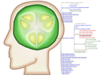

# cukehead

### Update 2023-07-17

This project is a learning exercise and a proof-of-concept experiment that ended in 2011.

The *learning* part was **Ruby** and **Cucumber**.

The *proof-of-concept* part was to explore representing **cucumber features in a mind map**, with a bi-directional capability.

When I was working on this project I knew that the implementation was tied too closely to the XML format used by FreeMind at the time. My plan, assuming that the initial POC proved useful, was to add an abstraction layer over the mind map implementation. That never came to be.

I took a new job in 2011 that required the bulk of my time, and it was not a Ruby job.

This project **will not work** with recent (like, after 2011) versions of FreeMind.

I'm leaving it here for reference only.

*Bill Melvin*

---

*I also made a logo using Inkscape.*

---

### Original README:

== cukehead

=== Introduction

Cukehead provides hours (well, maybe a couple minutes) of fun
exploring Cucumber feature files in the form of FreeMind mind 
maps. If you want to create feature files based on a mind map
it can do that too but I'm not sure anyone will want to do 
that.

Cukehead is the result of the author wanting to learn how Cucumber works
in preparation for a Rails project during the same period of time he was
exploring mind mapping software in a questionable attempt to become more
organized. Somehow the two came together as an exercise to learn how to
build a Ruby application.

=== Usage

cukehead command [options]

command:
  map
      Read Cucumber feature files and create a FreeMind mind map file.

  cuke
      Read a FreeMind mind map file and create Cucumber feature files.

options:
  -h or --help
      Show the help text.

  -o or --overwrite
      Overwrite existing output file(s).

  -m FILENAME or --mm-filename FILENAME
      map: Name of output file (default is mm/cukehead-output.mm).

  -f PATH or --features-path PATH
      map: Directory containing feature files to read (default is directory
      named 'features' in current directory).

      cuke: Directory feature files  will be written to.

  -s FILENAME or --source-mm FILENAME
      map: FreeMind mind map file to use as a template for creating
      the output file. If the template contains a node with the text
      'Cucumber features:' then the feature nodes will be inserted there.

=== Resources

Cucumber project: https://cucumber.io/

FreeMind project: https://en.wikipedia.org/wiki/FreeMind

=== Some Projects on GitHub that use Cucumber

https://github.com/alisonperez/chits

https://github.com/aslakhellesoy/cucumber-rails-test

https://github.com/engineyard/rails_dev_directory

https://github.com/jnicklas/carrierwave.git

https://github.com/mojombo/jekyll

https://github.com/radiant/radiant

https://github.com/technicalpickles/jeweler

https://github.com/webjam/webjam

